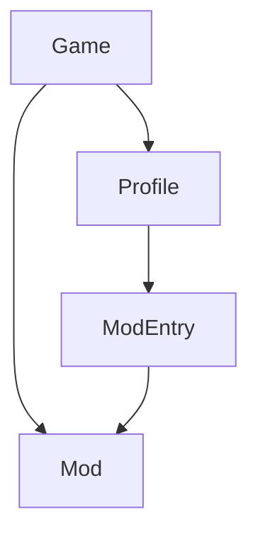

# `barnacle-lib`

## Database

Barnacle uses SQLite through [SeaORM]:

- `games`
- `profiles` with a `game_id`
- `mods` with a `game_id`
- `mod_entries` with a `profile_id`, `mod_id`, and `position`
- `tools` with a `game_id`
- `meta` for internal state such as schema version and UID allocation

The schema is as follows:

